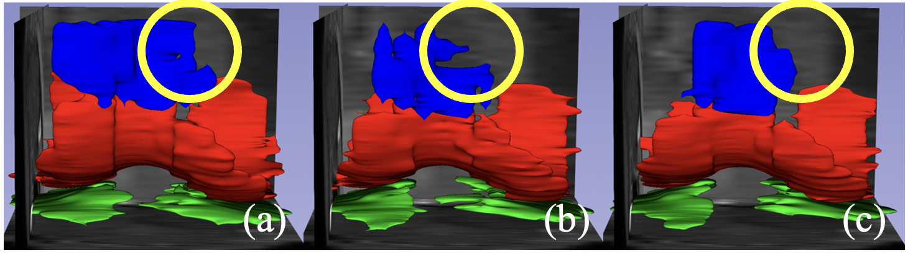

* Additional 3D Volumetric Results

3D volumetric visualization of a hard case for PC segmentation, (a) Ours, (b) SSFL, (c) Fed-Semi

3D volumetric visualization of a hard case for TC segmentation, (a) Ours, (b) SSFL, (c) Fed-Semi

3D volumetric visualization of FC, PC and TC of a patient. Left (ours), middle (SSFL), Right (Fed-Semi)