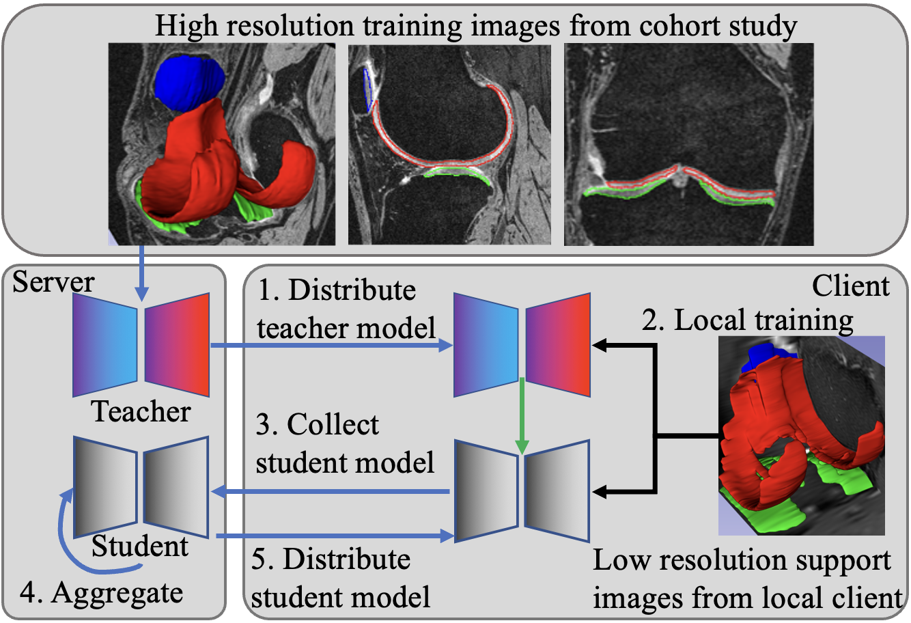

# Dealing With Heterogeneous 3D MR Knee Images: A Federated Few-Shot Learning Method With Dual Knowledge Distillation

Xiaoxiao He, Chaowei Tan, Bo Liu, Liping Si, Weiwu Yao, Liang Zhao, Di Liu, Qilong Zhangli, Qi Chang, Kang Li and Dimitris N. Metaxas

## Abstract:

Federated Learning has gained popularity among medical institutions since it enables collaborative training between clients (e.g., hospitals) without aggregating data. However, due to the high cost associated with creating annotations, especially for large 3D image datasets, clinical institutions do not have enough supervised data for training locally. Thus, the performance of the collaborative model is subpar under limited supervision. On the other hand, large institutions have the resources to compile data repositories with high-resolution images and labels. Therefore, individual clients can utilize the knowledge acquired in the public data repositories to mitigate the shortage of private annotated images. In this paper, we propose a federated few-shot learning method with dual knowledge distillation. This method allows joint training with limited annotations across clients without jeopardizing privacy. The supervised learning of the proposed method extracts features from limited labeled data in each client, while the unsupervised data is used to distill both feature and response-based knowledge from a national data repository to further improve the accuracy of the collaborative model and reduce the communication cost. Extensive evaluations are conducted on 3D magnetic resonance knee images from a private clinical dataset. Our proposed method shows superior performance and less training time than other semi-supervised federated learning methods.

In ISBI 2023

## Environment Requirements: 

Please create a conda environment using the environment.yaml

## Scripts to run different methods:

All scripts are located in experiments/distributed/segmentation_knee/

## Additional Results:

Due to the length of the paper, we put additional results [here](Additional_Results.md)

## Acknowledgments:
Our code borrows heavily from the FedCV implementation [FedML](https://github.com/FedML-AI/FedML)